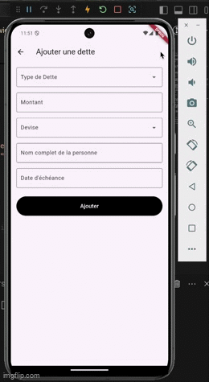

# 🔎 Debt Handling - Gestion de dettes

|  |
| :-----------------------------------------------------------------: |
|                             Pape THIAM                              |
|                              22009010                               |
|               [@mayel15](https://github.com/mayel15)                |
|                    papemayeldiagne.thiam@uphf.fr                    |

# 📱 Demo de l'application



# 🧰 Technos utilisées

<a href="https://dart.dev" target="_blank" rel="noreferrer">  </a> <a href="https://flutter.dev" target="_blank" rel="noreferrer">  </a>

# ➕ More

- [provider](https://pub.dev/packages/provider)
- [sqflite](https://pub.dev/packages/sqflite)

# 🧐 Description du projet et choix d'implémentation

## 📄 Description du projet

`Debt Handling` est une application de gestion de dettes pour aider les utilisateurs à suivre et gérer leurs dettes de manière efficace. Chaque utilisateur a une base de données locale où ses données seront sauvegardées. Ainsi, l'utilisation de l'application n'a pas besoin de connexion internet.
Voici les fonctionnalités :

- ajouter une dette (à rembourser ou à encaisser) avec des informations comme le montant de la dette (avec un choix de devises possibles `EUR [Euro], USD [Dollar] & XOF [Franc CFA]`), la personne concernée (son nom complet) et la date d'échéance de la dette
- payer (ou rembourser) une dette qui étéait due
- recevoir (ou encaisser) une dette que quelqu'un devait à l'utilisateur

⚠️ L'encaissement ou le remboursement supprime la dette de la base de données ⚠️

Les tabs `À rembourser` ou `À encaisser` permmettent de filtrer facilement les catégories de dettes.

## ⚙️ Choix d'implémentation

### Base de données

`SQLite` est utilisée pour stocker les données localement, permettant l'accès aux informations de dettes sans connexion Internet. SQLite est léger, rapide et parfaitement adapté aux applications mobiles pour une gestion efficace et sécurisée des données.

### Gestion des états avec Provider

`Provider` est utilisé pour gérer les états de l'application de manière efficace. Il permet une séparation claire des responsabilités entre les différentes parties de l'application, facilitant la mise à jour dynamique de l'interface lorsque les données changent (nouvelles dettes ajoutées, dettes supprimées, etc.).

# Cloner le projet

- Pré-requis: Vous devez avoir un émulateur `android (avec Android Studio)` ou un émulateur `ios (avec Xcode)` et le `SDK flutter` installé sur votre ordinateur avec les versions suivantes de préférence :

  - `Flutter v3.24.1`
  - `Dart v3.5.1`

- Cloner le projet avec `git clone https://github.com/mayel15/debt_handling.git`

- Aller dans le répertoire du projet

- Installer les dépendances avec `flutter packages get` ou `flutter pub add`

- Lancer l'application et trackez vos dettes en toute simplicité 🥳

# Release dans l'app store / test flight

- Open Xcode with the following command

```
open ios/Runner.xcworkspace
```

- Build ipa and submit

```
flutter build ipa
```
